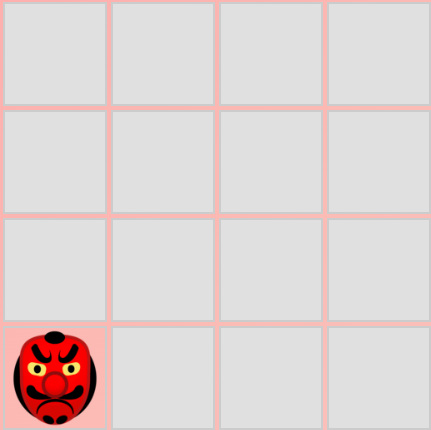

# 🧾 [Домашнее задание к занятию "2. DOM" — Перемещение элемента](./README_for_Netology.md)

---

### Перемещение элемента

#### Легенда

Вы решили развлечься и реализовать некое подобие игры, где гномы (или другие существа), выскакивают из "отверстий" и по ним нужно бить молотком:

#### Описание

Собрано игровое поле 4x4, где изображение гоблина (`img`) с интервалом перемещается по случайным ячейкам. Перемещение происходит с помощью изменения родительского узла, без удаления и пересоздания DOM-элемента.

**Ключевые особенности:**
- Сборка через Webpack
- Использование TypeScript, ESLint, Babel, Dev Server
- Анимация перемещений через `setInterval`
- Импорт изображений через Webpack

---

### 2. 🔢 In-Memory Sorting (дополнительная задача со звёздочкой)

#### Легенда

Намучившись с `data-*` атрибутами, мы переосмыслили подход и реализовали сортировку исключительно в памяти — без зависимости от DOM.

#### Описание

Реализован класс `MovieList`, который принимает данные о фильмах и:
- хранят их в памяти;
- отображает в виде таблицы;
- автоматически сортирует данные каждые 2 секунды;
- отображает текущую сортировку стрелочкой ↑ или ↓ в заголовке таблицы.

Сортировка выполняется циклически:
1. по `id` (возрастание, убывание),
2. по `title` (возрастание, убывание),
3. по `imdb`,
4. по `year`.

Значения форматируются в читаемом виде:
- `imdb: 8.90`
- `(1994)`
- `#223`

**Особенности реализации:**
- Вся логика сортировки инкапсулирована в `sortData()`
- Рендер обновляет DOM с нуля каждый раз
- Используется `keyof Movie` и строгая типизация

---

### 🌐 Демо:

Доступно по адресу:  
👉 [https://dm-morozov.github.io/Netology_52_working_with_dom/](https://dm-morozov.github.io/Netology_52_working_with_dom/)

---

## 📧 Контакты

Если возникнут вопросы, пишите:

*  [LinkedIn](https://www.linkedin.com/in/dm-morozov/)
*  [Telegram](https://t.me/dem2014)
*  [GitHub](https://github.com/dm-morozov/)
