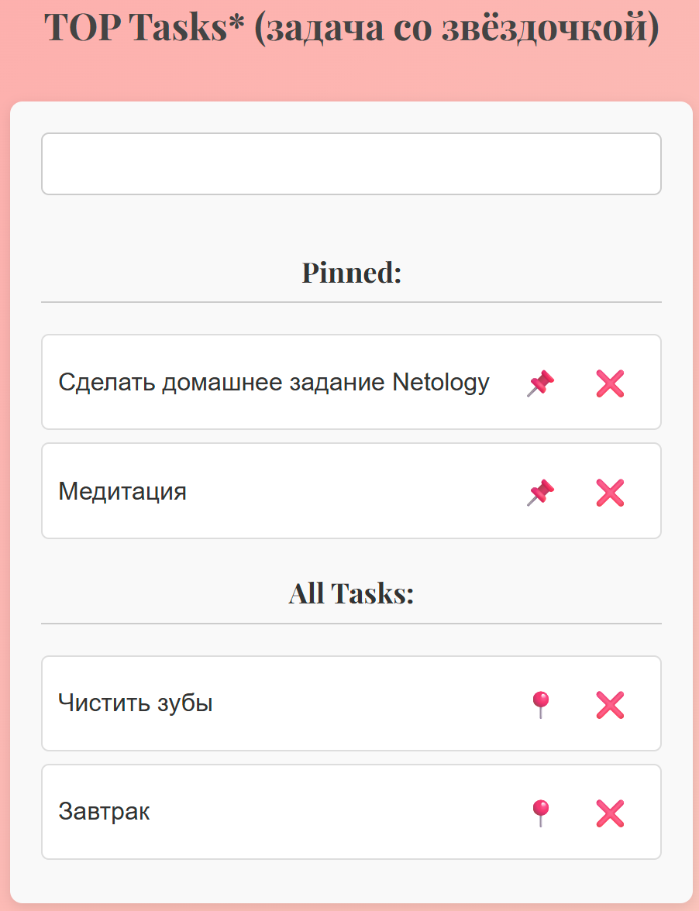

[](https://ci.appveyor.com/project/dm-morozov/netology-53-event-handling)


---

## 📘 Домашнее задание к занятию "3. Обработка событий"

### 📌 Правила сдачи задания:

* ✅ В рамках этого ДЗ **нужно использовать менеджер пакетов `yarn`**
  → Никакого `package-lock.json` в репозитории быть **не должно**
* ✅ Всё должно **собираться через Webpack**, включая:

  * изображения
  * стили
* ✅ Результат необходимо **выложить на GitHub Pages** с помощью **GitHub Actions**
  [Инструкция от Нетологии](./README_for_Netology.md)
* ✅ В `README.md`:

  * Бейджи CI
  * Ссылка на GitHub Pages

---

## 🎮 Игра с гоблинами


### 🧙 Легенда

Вы решили доделать игру с гоблинами, добавив оставшуюся игровую логику.

### 📋 Описание задачи

Нужно реализовать игру по следующим правилам:

* 🟢 Гоблин появляется в **рандомной ячейке** поля на **1 секунду**
* 🔨 Если пользователь успеет кликнуть по нему:

  * Засчитывается **+1 балл**
  * Гоблин исчезает
* 🔻 Если пользователь **не успеет**, считается **промах**

  * После **5 промахов** игра завершается
* 🖱️ **(опционально)** Реализуйте **кастомный курсор** в виде молотка
* 🧩 Код должен быть **структурирован через классы**

  * Каждый класс — за отдельную часть логики

---

## 🚀 Как запустить

```bash
git clone git@github.com:dm-morozov/Netology_53_event_handling.git
cd Netology_53_event_handling
yarn install
yarn start
```

### 🔧 Сборка:

```bash
yarn run dev
yarn run build
```

---

## 🧠 TOP Tasks \* (дополнительная задача)



### 🧩 Описание задачи

В рамках дополнительного задания реализован **трекинг задач с возможностью фильтрации и закрепления**:

* 📝 Добавление задач через поле ввода и клавишу `Enter`.
* ❌ Если поле пустое, под ним появляется **сообщение об ошибке** (без `alert` или `console`).
* 📌 **Закреплённые задачи ("Pinned")** отображаются отдельно и **не участвуют в фильтрации**.
* 🔍 В блоке **"All Tasks"** отображаются только **незакреплённые задачи**, соответствующие фильтру.
* 🚫 Если ничего не найдено по фильтру — показывается сообщение "No tasks found".
* 🔄 Все задачи хранятся в **едином массиве в памяти**, с сохранением в `localStorage`.

### 🧱 Архитектура

* Каждая задача — объект класса `Task`.
* Отрисовка списка задач построена **на основе данных в памяти**, а не вручную через DOM.
* Используется **структурированный подход через классы** и **разделение логики**.
* Проект собирается через **Webpack** и выкладывается на **GitHub Pages** с помощью **CI/CD (GitHub Actions)**.

### 🖼️ Интерфейс

Приложение состоит из:

* Поля ввода
* Блока **"Pinned"**
* Блока **"All Tasks"**
* Кнопок для закрепления 📍 и удаления ❌ задач

### 💾 Пример хранения задачи

```ts
interface ITask {
  id: number;
  title: string;
  pinned: boolean;
}
```

### 💡 Что добавлено

* Полностью реактивный интерфейс
* Сохранение задач между сессиями (через `localStorage`)
* Стильные кнопки и UI-обработка ошибок

---

## 🧪 Как запустить (повтор)

```bash
git clone git@github.com:dm-morozov/Netology_53_event_handling.git
cd Netology_53_event_handling
yarn install
yarn start
```

---

## 📂 Структура проекта

```
📁 src/                      # Исходный код
├── index.html              # Главная HTML-страница
├── index.ts                # Точка входа (импорт и запуск классов)
│
├── css/                    # Стили
│   └── styles.css          # Основной CSS-файл
│
├── img/                    # Изображения
│   └── ...                 # Картинки для проекта
│
├── ts/                     # TypeScript-модули
│   ├── __tests__/          # Тесты
│   ├── Game.ts             # Логика игры
│   ├── interface.ts        # Общие интерфейсы
│   ├── main.ts             # Основной скрипт, запускающий игру и задачи
│   ├── movieData.json      # Данные фильмов
│   ├── MovieList.ts        # Логика таблицы фильмов
│   ├── taskData.json       # (Не используется, ушли в пользу localStorage)
│   └── TOPTasks.ts         # Управление задачами (пин, фильтр, удаление)
│
└── types/                  # Вспомогательные типы, если будут добавлены
```

---

## 💡 Чему научился

* Работа с DOM через события
* Реализация игровой логики
* Делегирование событий и взаимодействие с элементами
* Использование таймеров (`setInterval`)
* Настройка Webpack и CI/CD через GitHub Actions
* Публикация проекта на GitHub Pages

---

### 🌐 Демо:

Доступно по адресу:  
👉 [https://dm-morozov.github.io/Netology_53_event_handling/](https://dm-morozov.github.io/Netology_53_event_handling/)

---

## 📧 Контакты

Если возникнут вопросы, пишите:

*  [LinkedIn](https://www.linkedin.com/in/dm-morozov/)
*  [Telegram](https://t.me/dem2014)
*  [GitHub](https://github.com/dm-morozov/)
